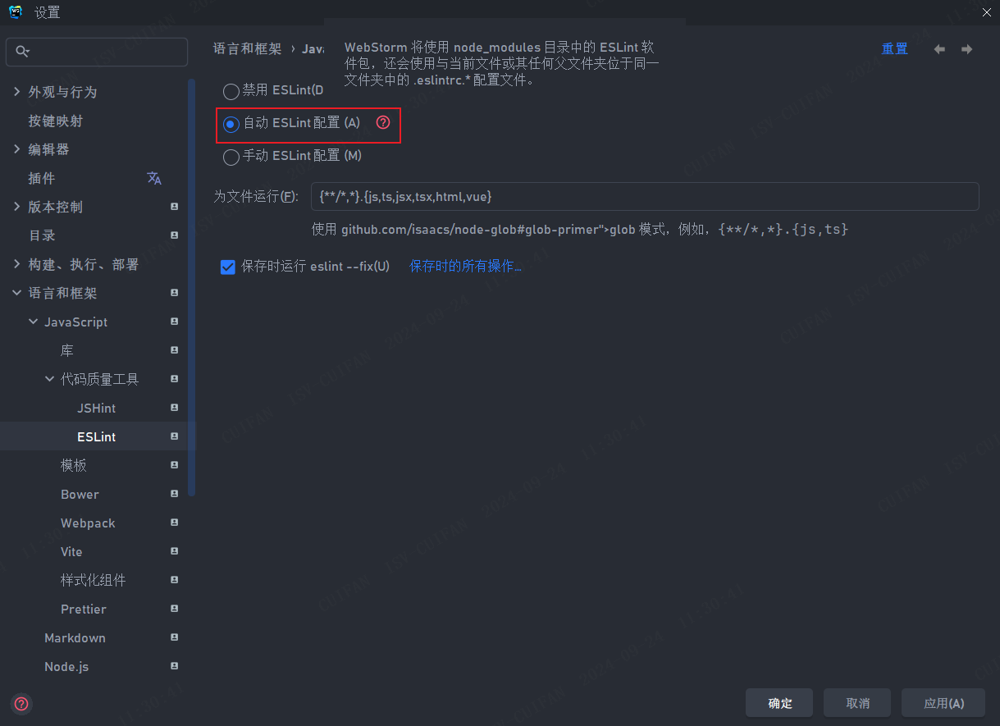
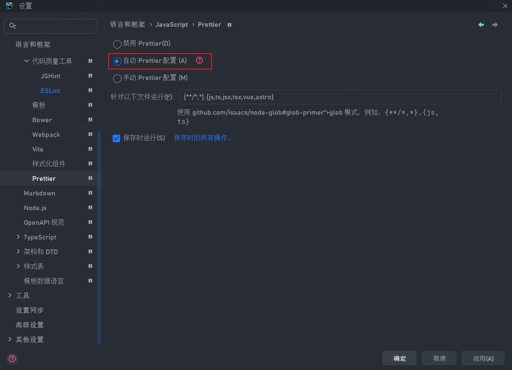
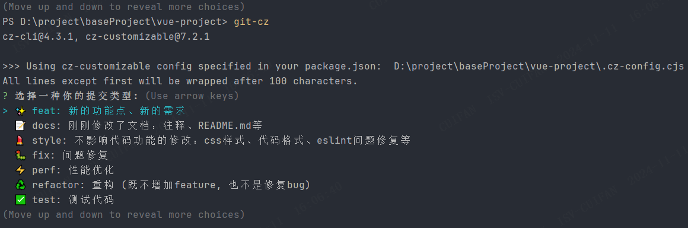
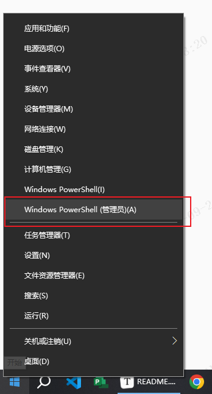
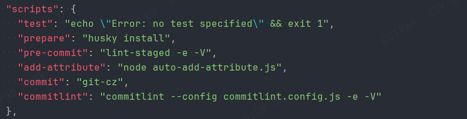

# AutoAddAttribute

自动为Vue、HTML项目的 DOM 模板添加属性。


## Recommended IDE Setup

-   [VSCode](https://code.visualstudio.com/) + [ESLint](https://marketplace.visualstudio.com/items?itemName=dbaeumer.vscode-eslint) + [Prettier](https://marketplace.visualstudio.com/items?itemName=esbenp.prettier-vscode) + [Volar](https://marketplace.visualstudio.com/items?itemName=Vue.volar) + [koroFileHeader]()
-   [WebStorm]() + [ESLint]() + [Prettier]() + [File Description]() + [Commit Message]()

## Environment

-   Node >= 18+
-   pnpm >= 9.6.0

## Project Setup

### Install

```bash
$ pnpm install
```

### Development

```bash
$ pnpm dev
```

### Before Coding

（1）IDE设置

确保编辑器正确配置`ESlint`、`Prettier`

 




`Ctrl + S`可在开发阶段格式化代码，`Control + Shift + I`打开控制台，`Control + R`刷新页面。

（2）Git Options 配置

修改`cz-config.cjs`文件`scope`为项目`src`结构。

### Before Commit

（3）config.json 配置

| 字段名    | 可选值                              | 含义                 |
| --------- | ----------------------------------- | -------------------- |
| type      | vue                                 | 要添加属性的文件类型 |
| attribute | any（eg. id \| class \| data-base） | 要添加的属性名       |
| path      | any（eg. './src'）                  | 脚本作用路径         |
| logs-size | any（eg. 1024）                     | 日志配额             |
| logs-path | any（eg. './logs'）                 | 日志保存路径         |

1. 正确填写 Commit 信息（少量多次，按功能提交）

（1）可视化命令行：
```shell
$ npx git-cz
```


（2）通过IDE:

格式：提交类型（修改范围）+简单描述 + 空行 + 详细描述

推荐插件：`Commit Message`（WebStorm）、`Commit Message Editor`（VS Code）

常见类型：

-   ~~feat - 新的功能点、新的需求
-   docs - 刚刚修改了文档：注释、README.md等
-   style - 不影响代码功能的修改：css样式、代码格式、eslint问题修复等
-   perf - 代码更改可以提高性能
-   refactor - 代码重构
-   test - 测试代码
-   build - 影响构建系统或外部依赖项的更改：build、package.json等
-   ci - 更改 CI 配置文件和脚本：Jenkinsfile等
-   revert - 代码回滚
-   other - 除以上所有类型外的其他提交~~


示例：

```text
feat(inlineDetection): 增加测点图导出功能。

提交详细描述信息（选填）
```

### Build

（1） 打包为Win平台

```shell
pnpm build:win
```

## F&Q

### 1. Git:warning: LF will be replaced by CRLF.

```shell
# For windows
// 关闭自动转换（当前仓库仓库）
$ git config core.autocrlf false
// 关闭自动转换（全局仓库）
$ git config --global core.autocrlf false
```

### 2. 打包时卡在transforming
出现这种问题通常是依赖文件没能拷贝进去（无权限访问或者安装到了开发环境）。



### 3. 往 Vue 项目迁移

（1）CommonJS 语法改为 ES Module 

脚手架支持 CommonJS 语法 (如Vite)时，直接将文件后缀从 `.js` 改为 `.cjs` 即可。

脚手架不支持 CommonJS 语法，需手动将 `require`、`__filename`、`__dirname`、`module.exports`等环境变量改为
ES Module格式。

（2）衡量是否需要日志系统

建议直接去除日志相关内容，比如`log4js`（占用过大）。

（3）Vue3 项目

由于 Vue3 转向了新的编译工具和构建流程，所以`vue-template-complier`需要使用`@vue/compiler-sfc`代替。注意对应获取template API也发生了变化。

```js
// old
import parser from 'vue-template-compiler'
const descriptor = parser.parseComponent(source, { pad: true });

// new
import parser from '@vue/compiler-sfc'
const { descriptor } = parser.parse(source, { pad: true });
```

（4）引入工作流

可在`package.json`中配置自定义命令（如`add-attribute`）进行启动。并与`pre-commit`、`lint-staged`搭配使用。配置文件详见`.lintstagedrc`、`.husky\\pre-commit`



## Warning

### 1. 命名规范

组件引用命名应遵守**Web组代码规范**，与原生 HTML 标签一致调用本脚本可能会出现引用失败。

```vue
# wrong 
import Header from './Header.vue'
<Header></Header>

# right 
import BaseHeader from './Header.vue'
<BaseHeader></BaseHeader>
```